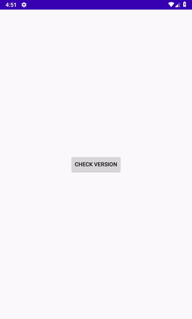

<h1 align="center">GitRelease</h1>
<p align="center">
<a href="https://www.codacy.com/gh/Pidsamhai/GitRelease?utm_source=github.com&amp;utm_medium=referral&amp;utm_content=Pidsamhai/GitRelease&amp;utm_campaign=Badge_Grade"></a>
<a href="https://jitpack.io/#Pidsamhai/GitRelease/"> </a>
<a href="https://kotlinlang.org">&nbsp </a>
<a href="https://github.com/Pidsamhai/GitRelease/blob/master/License.txt">&nbsp</a>
</p>
<p align="center">

</p>

## Jitpack

```kotlin
allprojects {
  repositories {
    ...
    maven { url 'https://jitpack.io' }
  }
}
```

```kotlin
dependencies {
  implementation 'com.github.Pidsamhai:GitRelease::<latest-version>'
  // This project uses kotlinx-coroutines.
  implementation 'org.jetbrains.kotlinx:kotlinx-coroutines-android:1.3.5'
}
```

## Setup

Permission AndroidManifest.xml

```xml
<uses-permission android:name="android.permission.INTERNET" />
<uses-permission android:name="android.permission.REQUEST_INSTALL_PACKAGES"/>
```

Add file provider in application tag

```xml
<provider
            android:authorities="{Your package name}.provider" 
            android:name="androidx.core.content.FileProvider"
            android:grantUriPermissions="true"
            android:exported="false">
            <meta-data
                android:name="android.support.FILE_PROVIDER_PATHS"
                android:resource="@xml/filepath"/>
</provider>
```

filepath.xml   res > xml

```xml
<?xml version="1.0" encoding="utf-8"?>
<paths>
    <external-files-path name="files" path="." />
</paths>
```

## Quick start

```kotlin
class MainActivity : AppCompatActivity() {

    @SuppressLint("SetTextI18n")
    override fun onCreate(savedInstanceState: Bundle?) {
        super.onCreate(savedInstanceState)
        setContentView(R.layout.activity_main)
        val owner = "owner" // Owner Name
        val repo = "repository" // Repository name
        val currentVersion = BuildConfig.VERSION_NAME
        val gitRelease = GitRelease(this, owner, repo, currentVersion).apply {
            loading = true
            checksum = true
        }
        gitRelease.checkNewVersion()
        checkVersion.setOnClickListener {
            gitRelease.checkNewVersion()
        }
    }
}
```

## Checksum template

*   support md5,sha1,sha256
*   If you don't want set checksum = false

```json
{
  "algorithm": "sha256",
  "type": {
    "md5": "265fd1f1bec425d4cfa2c7d3de80e669",
    "sha1": "78e2f1e29ac419ecd22a2da80e2971280bf08cc7",
    "sha256": "21ce8d224db9a70596f5fd4556d7bae8b3f1304ffdf954ebb649830fa2493cf8"
  }
}
```

### Changelog

#### v0.1-alpha

*   initial release

#### v0.2-beta

*   use [Markdown View](https://github.com/mukeshsolanki/MarkdownView-Android). You can use MarkDown template for changelog massage.
*   add checksum support

### v0.2.1-beta

*   Fix missing new version check
*   add Toast massage for latest version
*   fix markdown lint check (codacy)

## License

```text
            DO WHAT THE FUCK YOU WANT TO PUBLIC LICENSE
                    Version 2, December 2004

 Copyright (C) 2020 Pidsamhai <meng348@gmail.com>

 Everyone is permitted to copy and distribute verbatim or modified
 copies of this license document, and changing it is allowed as long
 as the name is changed.

            DO WHAT THE FUCK YOU WANT TO PUBLIC LICENSE
   TERMS AND CONDITIONS FOR COPYING, DISTRIBUTION AND MODIFICATION

  0. You just DO WHAT THE FUCK YOU WANT TO.
```
